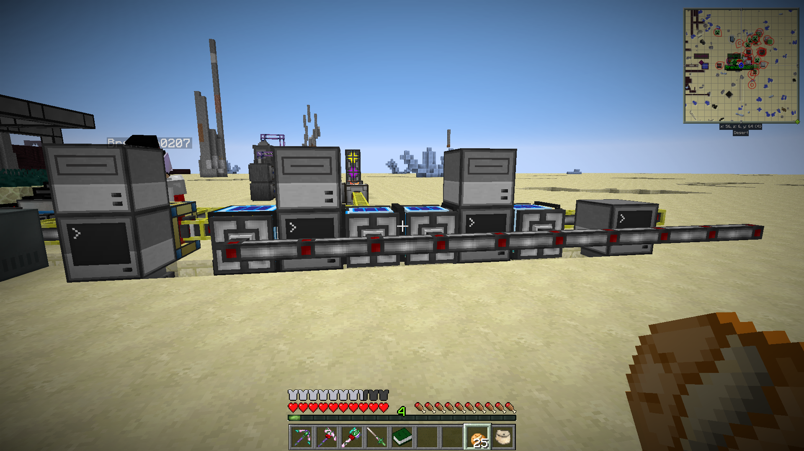
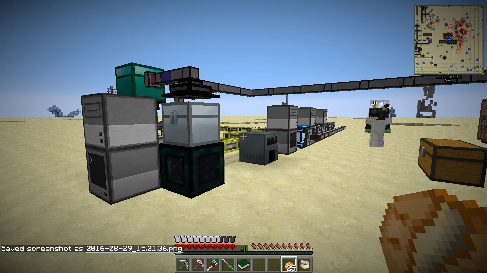
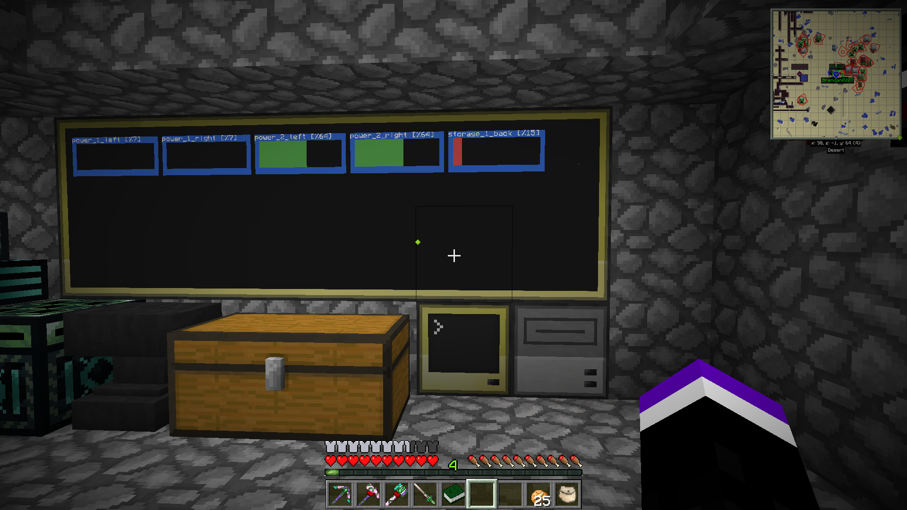
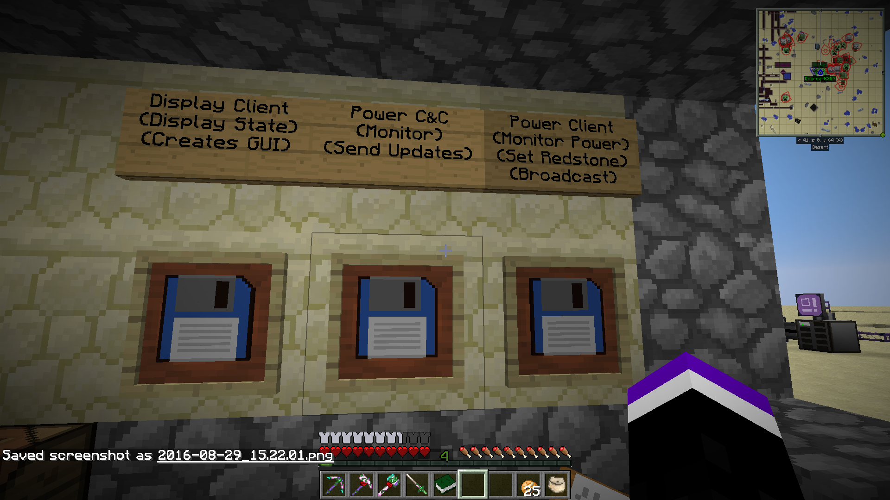

# Computer Craft IC2 Reactor Code

Nothing is truely lost as a hacker once you start pluggin in old hard
drives. This code is a reactor controll script for Industrial Craft 2
for Minecraft. This was built in the FTB Direwolf 20_17 modpack and
was a hell of a lot of fun to build. This was the first piece of code
I had ever worked on that built up a "distributed" system (even if it
was simulated). It was a lot of hard work and was nearly lost as, just
about 5 minutes ago, I decided to wipe the disk this was sitting on. I 
luckily thought "Eh. Why not see what's on it first?" and other than the
pile of viruses and memes I found this gem. 

# System Status Screen

 

# The "Reactors"

 

# The Control Setup

 

# The Holy Master Copies

 
